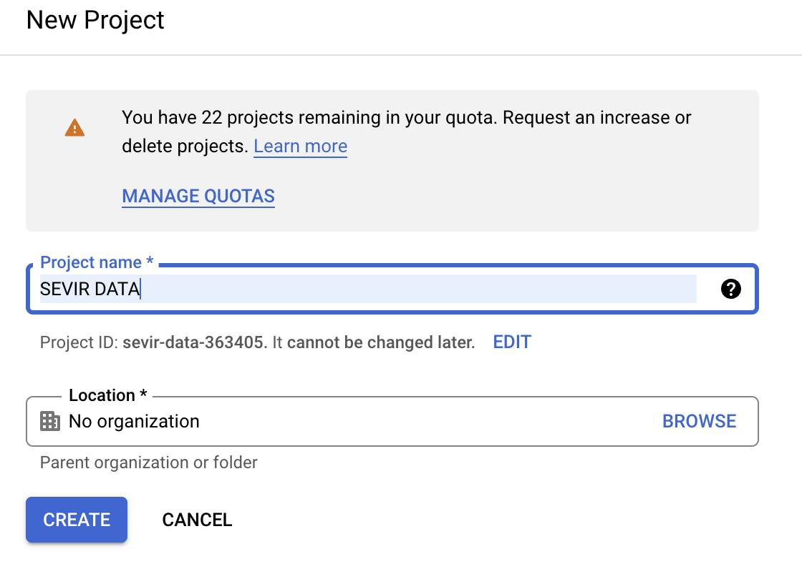
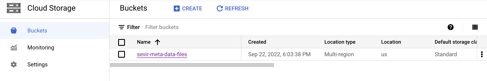
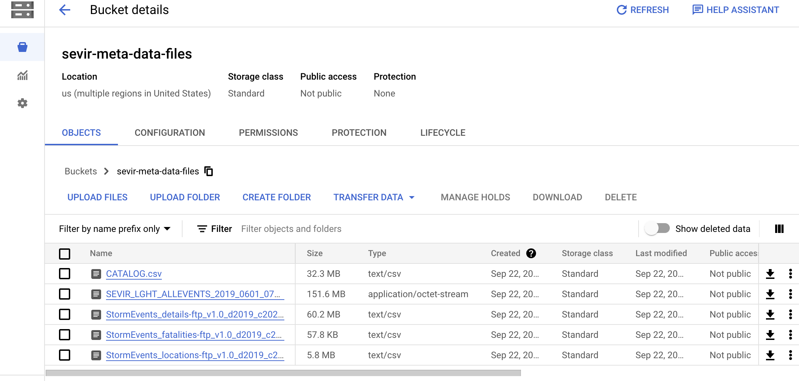
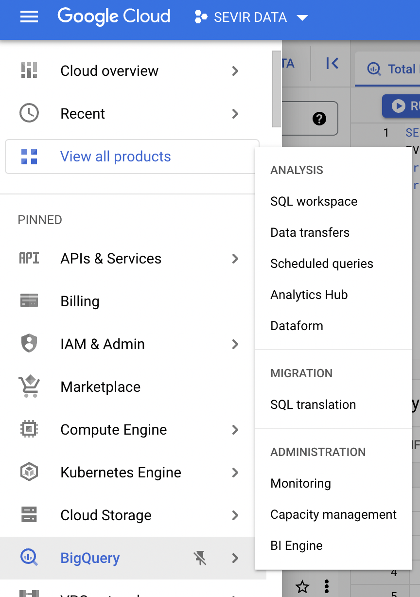
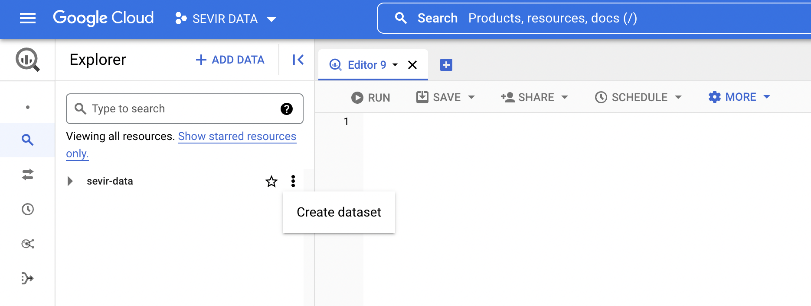
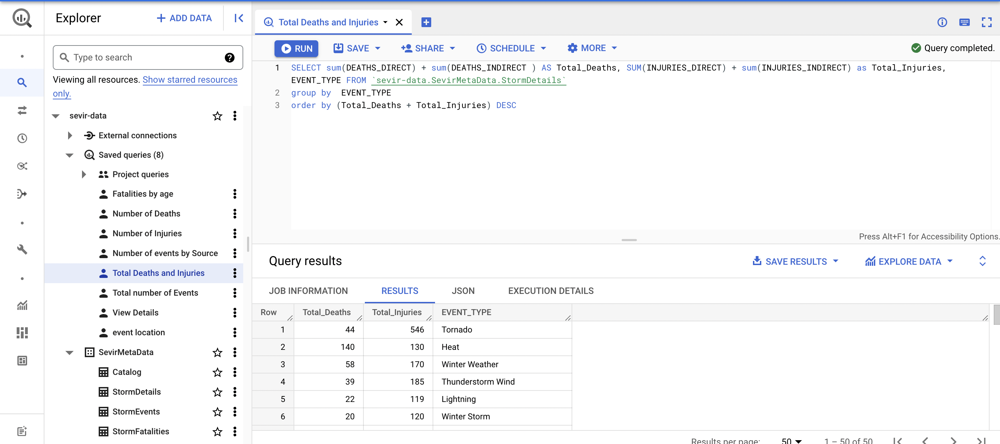
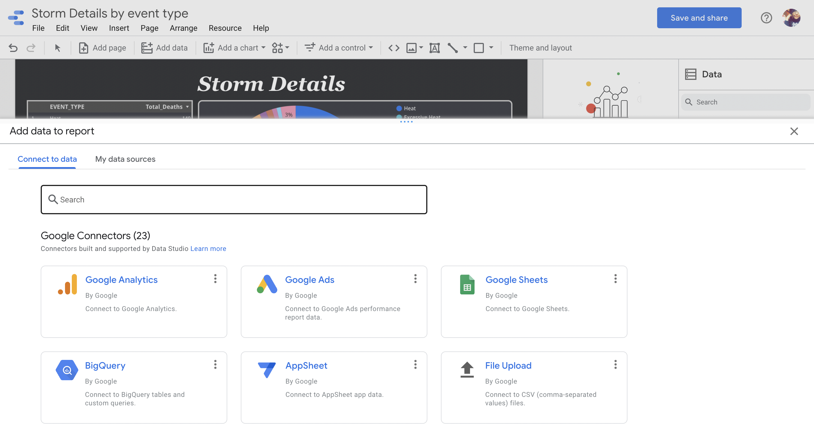
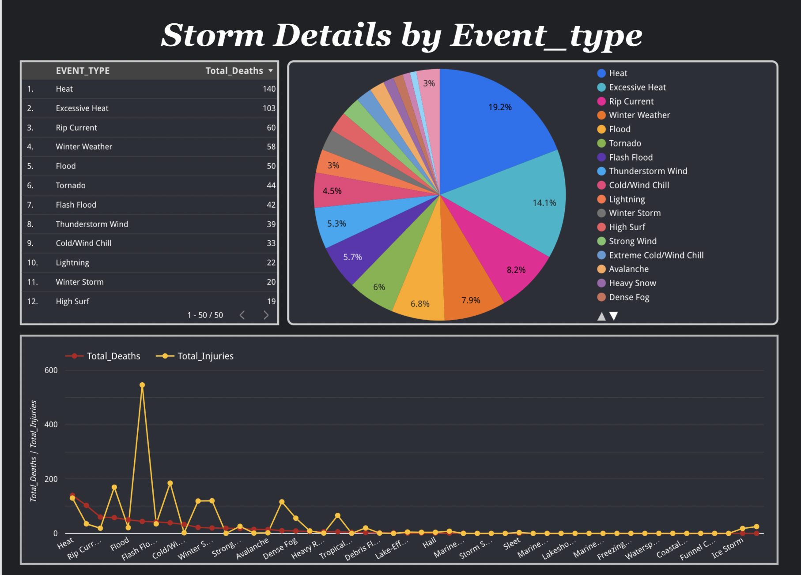
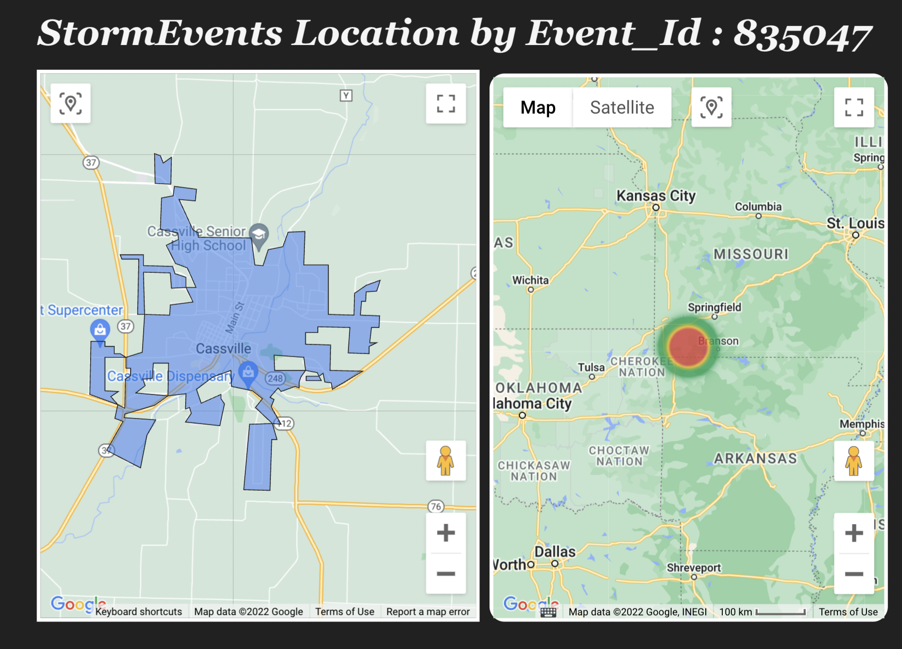
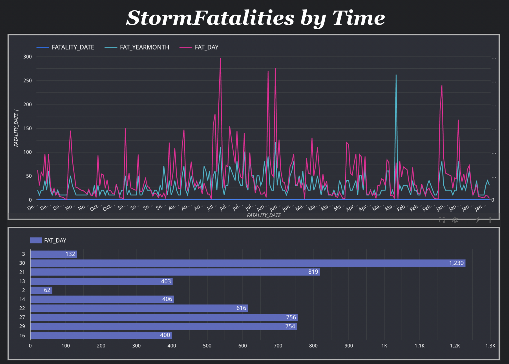

author: Moukthika Manapati
summary:
id: DAMG7241-assgn1
tags:
categories:
environments: Web
status: Published
feedback link: https://github.com/SolaceDev/solace-dev-codelabs/blob/master/markdown/DAMG7241-assgn1

# EXPLORING SEVIR DATA ON EVENT ID - S835047

## SEVIR DATASET

SEVIR - Storm EVent ImagRy 
This dataset consists of spatially and temporally images containing weather events captured by satellite. The below image shows thousands of samples in SEVIR dataset. These events consists of 4 hours of data in 5 hours increments sampled over the US. Each event in SEVIR has 5 different image types that are captured by 5 different sensors.

### Dataset Overview
## Big Query
BigQuery is a fully managed enterprise data warehouse with built-in features such as machine learning, geospatial analysis, and business intelligence that helps you manage and analyze your data.

* **Step 1:** Create a new **Project** on Google Cloud Platform

* **Step 2:** Create a **bucket** to store your data files

* **Step 3:** Upload the necessary data files to the created bucket

* **Step 4:** Select **BigQuery** once the data files are uploaded to the bucket

* **step 5:** Create a **Dataset** under the project once BigQuery is selected in GCP (make sure to toggle the auto detect check-box while creating tables)

* **Step 6:** Once the data is added start creating queries for Data 
Exploration
  

    The saved queries can be viewed later on through the dropdown feature
## Google Data Studio (GDS)
Google Data Studio (GDS) is a visualization tool that allows users to create interactive dashboards as well as customized, visually appealing reporting.The majority of Data Studio's features are simple to use, and it allows for simple report sharing and scheduling.

* Click on Add Data and select the BigQuery option to load the data.
 
* After selecting the data source, drag and drop the appropriate charts for visualizing the data 

### DASHBOARDS
 

 

 

## References

